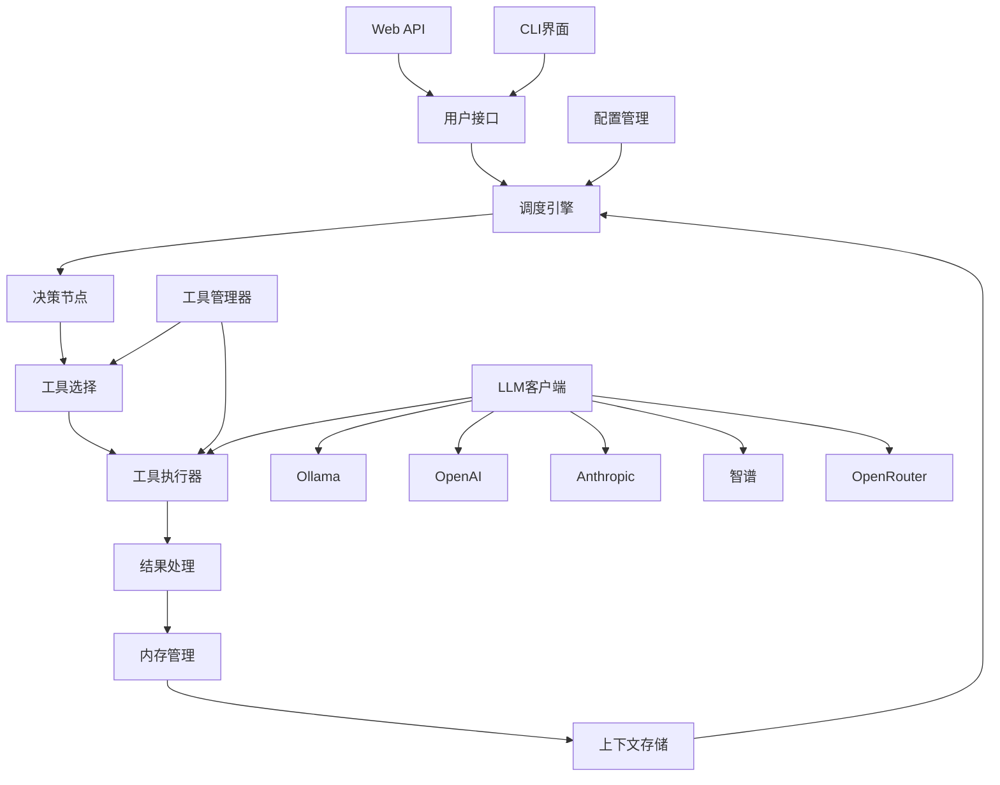

# PocketCore 系统架构设计

## 概述

PocketCore是一个基于PocketFlow框架构建的轻量级个人智能助手中枢系统。它旨在通过LLM高效调度和使用各种工具，为用户提供一个轻量、常驻的桌面智能助手。

## 系统特点

1. **轻量级**: 基于仅100行代码的PocketFlow框架，核心代码简洁高效
2. **模块化设计**: 采用模块化架构，易于扩展和维护
3. **工具调度**: 支持多种工具的动态注册和调度
4. **内存管理**: 内置持久化内存管理，支持上下文记忆
5. **多LLM支持**: 支持OpenAI、Anthropic、智谱、OpenRouter和本地Ollama等多种LLM
6. **模型自动发现**: 自动发现各提供商可用的模型
7. **多接口支持**: 提供CLI和Web API两种交互方式
8. **常驻运行**: 支持后台常驻运行，随时响应用户请求

## 架构图



## 核心组件

### 1. 调度引擎 (core/engine.py)

调度引擎是系统的核心，基于PocketFlow框架实现。它负责协调各个组件的工作流程：

- **DecisionNode**: 决策节点，根据用户查询决定使用哪个工具
- **ToolExecutorNode**: 工具执行节点，负责调用具体工具处理请求
- **MemoryNode**: 内存管理节点，负责保存交互历史和上下文信息

### 2. 工具管理器 (core/tools.py)

工具管理器负责管理所有可用的工具：

- **BaseTool**: 工具基类，定义工具接口
- **LLMClient**: 多LLM客户端管理器，支持Ollama、OpenAI、Anthropic、智谱、OpenRouter
- **GeneralChatTool**: 通用聊天工具
- **WebSearchTool**: 网络搜索工具
- **CalculatorTool**: 计算器工具
- **TranslatorTool**: 翻译工具
- **ModelDiscoveryTool**: 模型发现工具
- **ToolManager**: 工具管理器，负责工具的注册、获取和管理

### 3. 内存管理器 (core/memory.py)

内存管理器负责持久化存储用户交互历史和上下文信息：

- 使用SQLite数据库存储数据
- 支持交互历史的保存和查询
- 支持上下文信息的保存和获取

### 4. 配置管理 (config.py)

配置管理模块负责管理系统的所有配置项：

- LLM API密钥配置
- 各LLM提供商的配置
- 服务器配置
- 数据库配置
- 调试配置等

## 工作流程

1. 用户通过CLI或Web API发送请求
2. 调度引擎接收请求并初始化共享状态
3. 决策节点分析用户查询，决定使用哪个工具
4. 工具执行器调用相应工具处理请求
5. LLM客户端根据配置选择合适的LLM提供商
6. 内存管理器保存交互历史和更新上下文
7. 返回处理结果给用户

## 多LLM支持

### LLM客户端管理器

系统通过 [LLMClient](file:///Users/lvyun/nacoolab/02-Planning-lab/PocketCore/core/tools.py#L14-L177) 类统一管理多种LLM提供商：

1. **Ollama**: 本地运行的LLM，无需API密钥
2. **OpenAI**: 云端LLM，需要API密钥
3. **Anthropic**: 云端LLM，需要API密钥
4. **智谱**: 云端LLM，需要API密钥
5. **OpenRouter**: 云端LLM，需要API密钥

### 配置优先级

1. 环境变量配置
2. 默认配置值
3. 自动降级到Ollama（如果可用）

### 切换LLM提供商

通过修改 `.env` 文件中的 `DEFAULT_LLM_PROVIDER` 变量来切换LLM提供商：

- `ollama`: 使用本地Ollama
- `openai`: 使用OpenAI API
- `anthropic`: 使用Anthropic API
- `zhipu`: 使用智谱API
- `openrouter`: 使用OpenRouter API

## 模型自动发现

### 动态发现

- **Ollama**: 通过API动态获取本地可用模型列表
- **其他提供商**: 基于预定义的常用模型列表

### 模型发现工具

系统提供了一个专门的 [ModelDiscoveryTool](file:///Users/lvyun/nacoolab/02-Planning-lab/PocketCore/core/tools.py#L166-L177) 工具，用户可以通过CLI或API查询所有可用的模型。

## 扩展机制

### 添加新工具

1. 继承BaseTool类创建新工具
2. 实现execute方法
3. 在ToolManager中注册工具

### 添加新节点

1. 继承Node类创建新节点
2. 实现prep、exec、post方法
3. 在Flow中连接节点

### 添加新LLM提供商

1. 在 [LLMClient](file:///Users/lvyun/nacoolab/02-Planning-lab/PocketCore/core/tools.py#L14-L177) 中添加新的调用方法
2. 更新配置管理
3. 更新环境变量配置
4. 更新模型发现功能

## 部署方式

### 命令行模式

```bash
python main.py
```

### Web服务模式

```bash
python api.py
```

或者使用uvicorn直接运行：

```bash
uvicorn api:app --host 127.0.0.1 --port 8000
```

## API接口

### GET /

根路径，返回系统状态信息

### GET /tools

获取所有可用工具列表

### GET /models

获取所有可用模型列表

### POST /query

处理用户查询请求

请求体：
```json
{
  "query": "用户查询内容",
  "context": {"key": "value"}  // 可选的上下文信息
}
```

响应：
```json
{
  "result": "处理结果",
  "context": {"key": "value"}  // 更新后的上下文信息
}
```

### GET /memory

获取交互历史

参数：
- limit: 返回记录数量限制（默认10）

## 性能优化

1. **缓存机制**: 对频繁请求的结果进行缓存
2. **异步处理**: 使用异步IO提高并发处理能力
3. **连接池**: 数据库连接池管理
4. **资源复用**: 工具实例复用，减少初始化开销

## 安全考虑

1. **API密钥保护**: 通过环境变量管理敏感信息
2. **输入验证**: 对用户输入进行严格验证
3. **访问控制**: 支持API密钥验证（可扩展）
4. **日志记录**: 记录关键操作日志

## 未来扩展

1. **插件系统**: 支持动态加载第三方工具插件
2. **多LLM支持**: 支持多种大语言模型切换
3. **语音交互**: 集成语音识别和合成能力
4. **桌面集成**: 系统托盘集成，提供更便捷的访问方式
5. **移动端支持**: 开发移动端应用，实现跨平台使用
6. **模型版本管理**: 支持模型版本控制和切换
7. **模型性能监控**: 监控各模型的响应时间和准确性